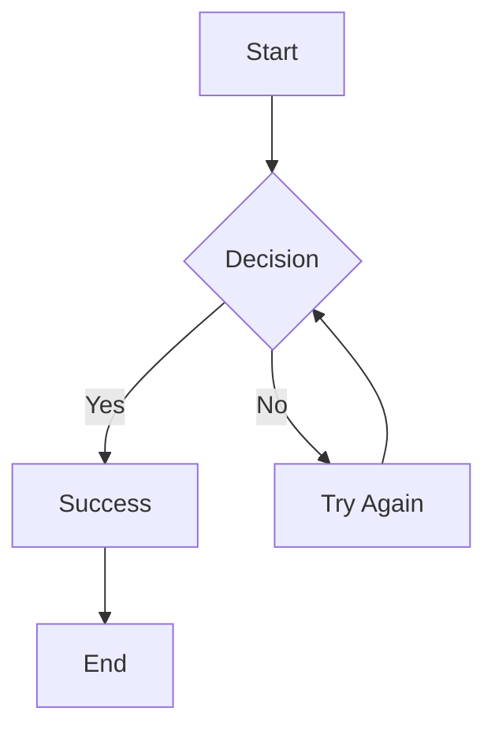

Here’s a Markdown-formatted summary of the [Streamdown](https://streamdown.ai/) page content:
# Streamdown

**A drop-in replacement for `react-markdown`, designed for AI-powered streaming.**

## 🚀 Installation

```bash
npx ai-elements@latest add response
# or
npm i streamdown
```

## 🧠 Overview

Streaming Markdown introduces challenges with formatting and safety. Streamdown solves this by offering:

- Safe, well-formatted Markdown rendering
- Built-in support for AI streaming
- Integration with AI Elements Response component

## 💡 Features

### ✅ GitHub Flavored Markdown (GFM)

| Feature         | Standard MD | GFM |
|----------------|-------------|-----|
| Tables          | ❌          | ✅  |
| Task Lists      | ❌          | ✅  |
| Strikethrough   | ❌          | ✅  |

**Task List Example:**
- [x] Implement authentication  
- [x] Add database models  
- [ ] Write unit tests  
- [ ] Deploy to production  

**Strikethrough:**  
~~Old approach~~ → New approach with AI models

### 📦 Built-in Styling

Includes Tailwind CSS classes for headings, lists, code blocks, etc.

```css
@source "../node_modules/streamdown/dist/index.js";
```

### 🔐 Security Hardening

Blocks untrusted links and images to prevent prompt injection.

### 🧮 Math Support

Supports LaTeX via `remark-math` and KaTeX.

```latex
Euler's identity: $$e^{i\pi} + 1 = 0$$
```

### 📊 Mermaid Diagrams

Supports interactive Mermaid diagrams with theme customization.



### 💻 Code Blocks with Shiki

```tsx
export const Button: React.FC<ButtonProps> = ({ label, onClick }) => (
  <button type="button" onClick={onClick}>{label}</button>
);
```

### 🧩 Props

```ts
type StreamdownProps = {
  children: string;
  parseIncompleteMarkdown?: boolean;
  className?: string;
  components?: object;
  allowedImagePrefixes?: string[];
  allowedLinkPrefixes?: string[];
  defaultOrigin?: string;
  rehypePlugins?: array;
  remarkPlugins?: array;
  shikiTheme?: [string, string];
  mermaidConfig?: object;
  controls?: boolean | { table?: boolean; code?: boolean; mermaid?: boolean };
};
```

## ❓ FAQ

- What makes Streamdown different from `react-markdown`?
- Can I use custom components?
- How does incomplete markdown parsing work?
- Is it compatible with all plugins?
- How do I configure Tailwind CSS?

---

## Where our project may need fixing

Short answer: mostly, yes—but you’re overriding a couple of things Streamdown already does better out-of-the-box, and you’re missing one required Tailwind config line.

### What to fix (from first principles)

1. **Don’t override `pre`/`code`**
   Streamdown ships Shiki highlighting + copy buttons and handles incomplete code fences during streaming. Your custom `pre`/`code` will disable those niceties. Remove those overrides unless you’re re-implementing the features. ([GitHub][1])

2. **Enable its styles in Tailwind**
   Add this to your global CSS so Streamdown’s built-ins (typography, code controls, math/KaTeX, etc.) actually load:
   `@source "../node_modules/streamdown/dist/index.js";` ([GitHub][1])

3. **Let Streamdown’s default typography work**
   You can keep `prose` if you want, but Streamdown already includes sensible Tailwind classes for headings/lists/tables. Start simple; only override headings once you’ve seen the defaults. ([streamdown.ai][2])

4. **Optional hardening / features**

   * If you render untrusted content, set `allowedLinkPrefixes` / `allowedImagePrefixes`.
   * If you want Mermaid or math, pass `mermaidConfig` or keep remark/rehype defaults.
   * You can tweak Shiki themes via `shikiTheme`. ([GitHub][1])

### Cleaned-up component (safe defaults)

```tsx
import { Streamdown } from 'streamdown';

export function MarkdownContent({ content }: { content: string }) {
  return (
    <div className="streamdown-wrapper text-gray-900">
      <Streamdown
        className="prose prose-gray max-w-none"
        // Keep components minimal; avoid pre/code overrides
        components={{
          h1: ({ children }) => <h1 className="mt-8 mb-4">{children}</h1>,
          h2: ({ children }) => <h2 className="mt-7 mb-3">{children}</h2>,
          p:  ({ children }) => <p className="mb-4 leading-relaxed">{children}</p>,
          a:  ({ children, href }) => (
            <a href={href} className="underline" target="_blank" rel="noopener noreferrer">{children}</a>
          ),
          // leave lists/tables if you want, but no pre/code here
        }}
        // Optional hardening + theming:
        // allowedLinkPrefixes={['https://', 'mailto:', '#']}
        // shikiTheme={['github-light', 'github-dark']}
        // mermaidConfig={{ theme: 'default' }}
      >
        {content}
      </Streamdown>
    </div>
  );
}
```

### Quick checklist

* Installed: `npm i streamdown` ✔️ ([GitHub][1])
* Tailwind globals: `@source "../node_modules/streamdown/dist/index.js";` ✔️ ([GitHub][1])
* Don’t override `pre`/`code` unless re-adding Shiki + copy ✔️ ([GitHub][1])
* If you stream tokens, append text to the same component instance (Streamdown handles incomplete markdown) ✔️ ([GitHub][1])

If you want, I can tailor this to your exact streaming loop (AI SDK `useChat` vs your own SSE).

[1]: https://github.com/vercel/streamdown "GitHub - vercel/streamdown: A drop-in replacement for react-markdown, designed for AI-powered streaming."
[2]: https://streamdown.ai/?utm_source=chatgpt.com "Streamdown"

